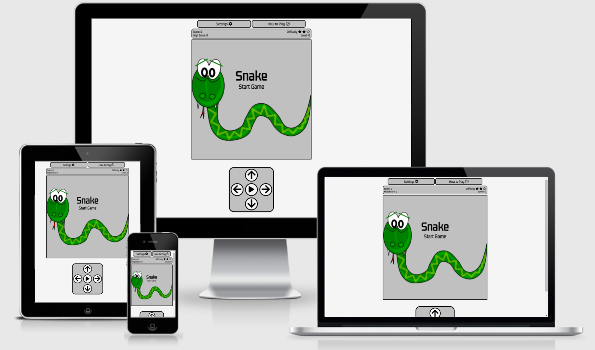
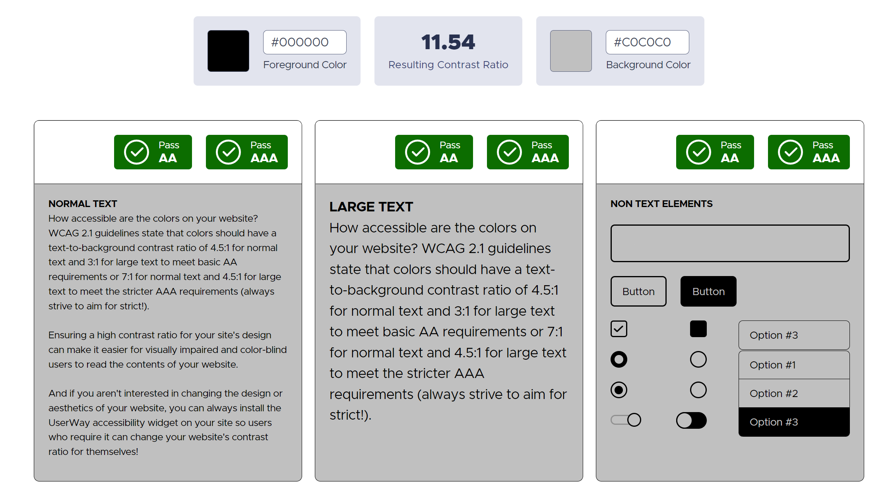
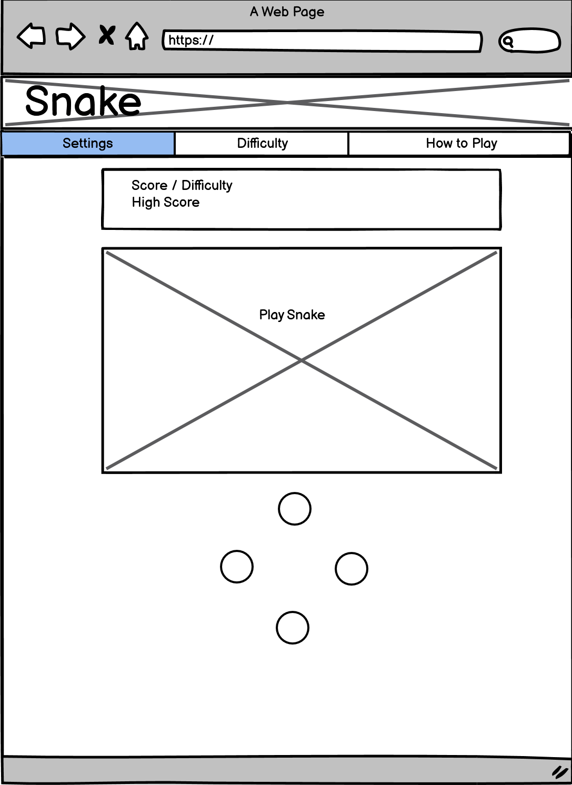
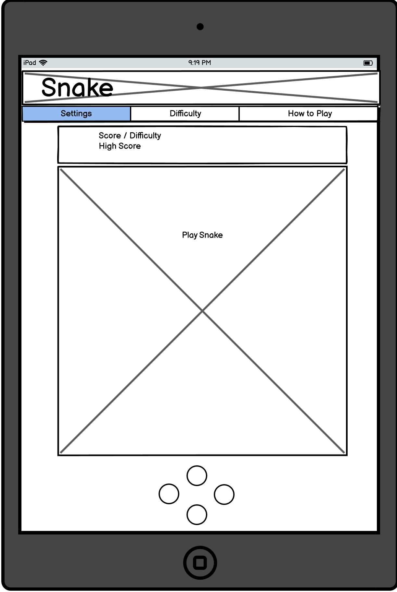
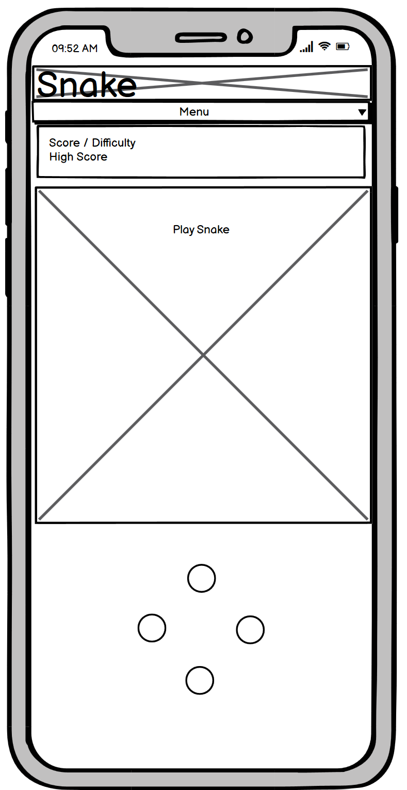
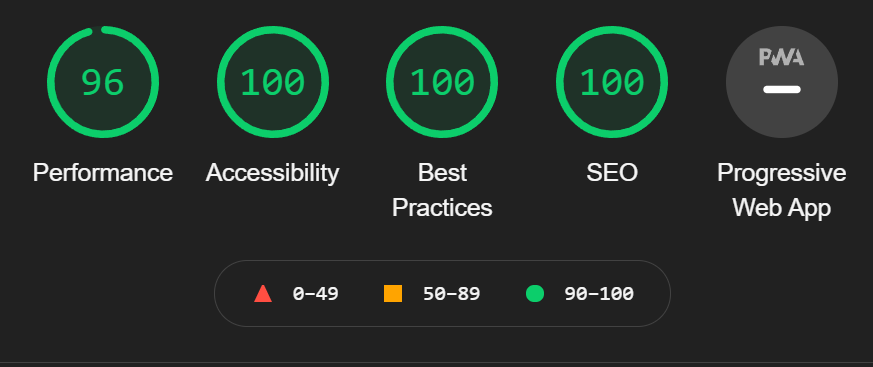
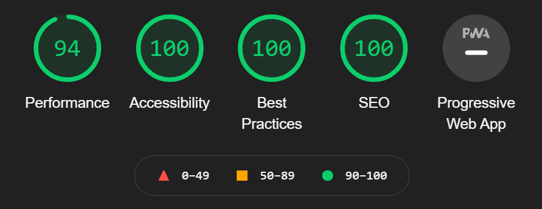
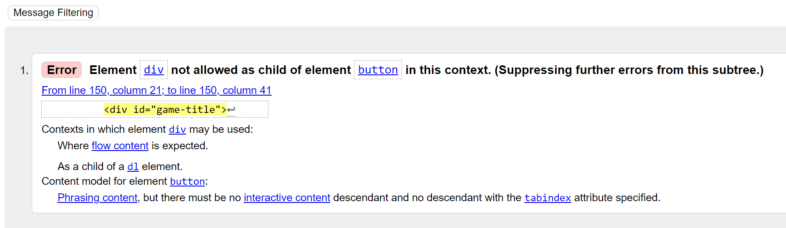

# **A Game of Snake**
 

## Table of Contents
1. [**Planning Stage**](#planning-stage)
1. [**Features**](#features)
1. [**Future Features to be Added**](#future-features-to-be-added)
1. [**Testing**](#testing)
1. [**Bugs**](#bugs)
1. [**Deployment**](#deployment)
1. [**Technology Used**](#technology-used)
1. [**Credits**](#credits)

## Planning Stage

### Project Goals
The goal of this project was to create a simple game for users to play, whilst providing several customisable options as well as multiple control schemes for ease of use

### User Goals
The target user is someone who wants to kill some time with a simple fun game
 * A casual gamer
 * A user who likes to fill their time with something quick and easy
 * A user looking to play a game whilst commuting or on a break at work

 ### User Stories
 * As a user I want the site to be easy to use and easily navigable
 * As a user I want to be able to challenge myself to beat my previous best score
 * As a user I want to be able to customise my game area to look and feel exactly as I want it
 * As a user I want to be able to control the game easily
 * As a user I want to be able to pick up and play a simple fun game

 ### Design Goals
 * A simple minimilistic site that works on all devices
 * Customisation options
 * Easy to use controls
 * Be fun enough for users to return to the site and play again

### Design Choices
 
 #### Font
 Designing Snake I wanted to go for a retro feel and picked a single font from google fonts called Gemunu Libre which was in keeping with the minimilistic design and retro feel.

 #### Color Scheme
 As an initial color scheme I went with a smoky white background and a grey/silver game canvas and control area. This gives a good contrast but also stays in line with the retro theme. 
 For the Settings modal's I went for a bright yellow to really help it stand out and grab the users attention as they customise their game. 
 For the game itself I went with a green snake with red and green "apples" for food, trying to keep the colors as authentic as possible.
 * Background: #f5f5f5
 * Game Canvas and Information panels: #c0c0c0
 * Snake: #008000
 * Food: #C7372F
 * Bonus Food: #8DB600
 I used (https://userway.org/) to check the contrasting colors worked well
  

### Wireframes
I used wireframes to initially plan the project. As the project developed I made some alterations based on design challenges I faced, particularly for mobile devices and the need for the touch controls and the
game canvas to all fit on screen. 

## Features

### Difficulty
There are 3 difficulty settings. 
 * Easy: The snake starts at a slower pace and scores 20 per food eaten.
 * Medium: The snake starts at a moderate pace and scores 30 per food eaten.
 * Hard: The snake starts at a fast pace and scores 50 per food eaten.

 Regardless of difficulty setting, for every food eaten, the user will level up and the snake will move slightly faster. Even on easy difficulty the snake can end up moving really fast.
 However, the users highest potential score will be lower on the easier difficulties. 

### Food
Food is generated at game start and everytime the snake "eats" the food to increase score.
Bonus food is generated everytime the user levels up and despwans after a few seconds. If the snake eats the bonus food the user gains a +10 pint bonus per food eaten for that level.

### Customisation
Users can set the page up how they like, changing the background color of the page, game area, the snake and the snake outline to create a truly personailised page based on the users preferences.

### Controls
There are several options for users to play. They can use touch controls, 2 sets of keyboard inputs (arrow keys and wasd) and several sets of gamepad inputs (D-Pad, anaologue sticks, face buttons)
allowing users to use what control scheme is most comfortable to them.

### High Score
A users high score is stored, allowing the user to compete against themselves. 

## Features to be added
As with any project, ongoing development is always key. Future features I would like to plan into my project are: 
 * Global leaderboards
 * More level types - add in hazards to the game area for the snake to avoid
 * Score X amount of points to advance to the next game area
 * Improved graphics
 * Different game modes - e.g can pass through walls and appear on opposite side of game area rather than game over

 ## Testing

 ### Responsiveness
 The site is fully responsive and the game area scales down by device size to ensure a smooth experience on all devices. The only issue I encountered was finding a compromise on the touch input button sizes to ensure that screen sizes as small as an iPhone 5 could display the game area and the touch controls on screen. 

 ### LightHouse
Before running Lighthouse I converted the snake image into the webp format. Webp is a new image format which is significantly smaller in file size to png and jpg and will be the new standard for images in the future. Before converting my images i checked (https://caniuse.com/webp) for compatability. It is compatable on all browsers expect for IE 11 and is compatable on macOS 11 Big Sur and later. This gave what I felt to be an acceptable level of compatability to warrant its use.

 ## Desktop
 

 ## Mobile
 

  ### **Validators**

All HTML files were run through (https://validator.w3.org/) and my CSS file was run through (https://jigsaw.w3.org/css-validator/) to ensure all code meets the correct standard. 
There was one error found in the HTML, however, this part of the code formed a vital function of the game and despite trying to fix I could not find a solution. No errors were found for the CSS. 

For javasscript, snake.js and modal.js were run through (https://jshint.com/) and no errors were found. 

## Bugs
During the development of Snake I encountered numerous obstacles and bugs. A few of larger ones are listed below.

### Fixed Bugs
 * Bug: Snake was merging with canvas border but "still in play". 
   * Fix: Set canvas border width to same as snake (pixelSize) and tweaked border size by a pixel to get a pixel perfect layout.
 * As canvas size decreased with screen size it created odd pixel alignment causing the snake to trigger wall collision before actually hitting the barrier.
   * Fix: Standardised canvas size based on screen size (300, 450 or 600 pixels wide and tall) and set snake size to the matching ratio (10px, 15px and 20px) to maintain game integrity.
 * Bug: When game over alert was displaying game could be started with controller when pressing start.
   * Fix: Set a gamepad stop function and call it in a timeout function the same length as the alert to disable button functionality.
 * Bug: Gamepad could record multiple button presses in a single tick resulting in the snake turning in on itself and calling game over.
   * Fix: set stopControls to true and call a timeout function to turn controls back on after 50 miliseconds. 
 * Bug: When implementing local storage variables, score would update as a string. 
   * Fix: Call score as a parseInt when calling the value from local storage to convert into an integer.

### Known Bugs
 * On IOS sounds do not play correctly. This is due to inbuilt OS settings which stop sounds playing by default.
 * On IOS haptic feedback does not play when using touch controls. Again this is because of OS system settings.

## Credits

### Content
* The Snake game was inspired by (https://www.educative.io/blog/javascript-snake-game-tutorial). 
Whilst I have tried to deviate as much as possible and add many additional features, there may be some similarities in the code

### Media
* The canvas image was taken from (https://pixabay.com)
* Icons used were from (https://fontawesome.com/)
* Game Over alert was created using SweetAlert2 (https://sweetalert2.github.io/). The script was downloaded directly to the project as the site advised that calling the script from their site could cause some performance issues
* Sound effects were taken from (https://mixkit.co/free-sound-effects/)
* The Haptics effect JavaScript file for Android phones was taken from (http://hapticsjs.org/)
* The script to enable controller inputs was taken from (https://github.com/alvaromontoro/gamecontroller.js/)
* Favicon images were generated with (https://realfavicongenerator.net/)

### Thanks
* [Richard Wells](https://github.com/D0nni387) - Code Institute mentor who's advice and guidance supported me in the completion of this project and encouraged me to go above and beyond what I thought I could achieve. 